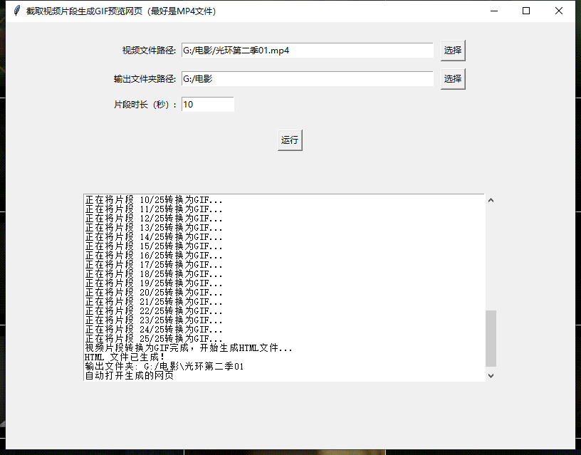

# 视频切片转GIF用网页预览
 
一键将视频分割成动图预览网页

 
 
“.exe”结尾都是可执行文件，优点是不用自行安装模块。 
要求： 
------需要下载ffmpeg并正确把ffmpeg添加到win环境变量。 
------也可以将"ffmpeg.exe" "ffprobe.exe" ，放到exe文件同目录。 
 
“.py”结尾的文件是源码，需要请自行安装所需模块。 
 
“.bat”结尾的文件是win系统的可执行脚本，和exe文件同样的要求。 
 

 
